# Microservice_Monitoring

A comprehensive full-stack monitoring solution for microservices architectures, featuring automated deployment, health tracking, visualization, and alerting capabilities.

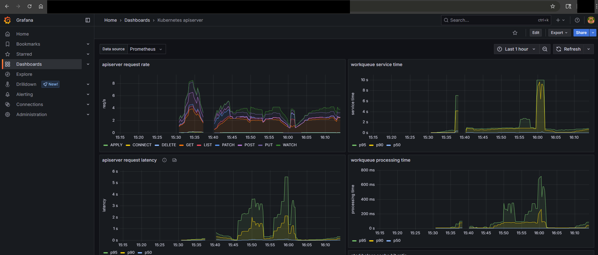

## Overview

This project demonstrates a complete monitoring stack for microservices deployed on Kubernetes (Minikube), including:

- **Application Layer**: Sample frontend and backend microservices  
- **Monitoring Stack**: Prometheus, OpenTelemetry, Jaeger, Loki, and Grafana  
- **GitOps Integration**: ArgoCD for continuous deployment  
- **Local Development**: WSL2 and Docker Desktop integration  

## Environment Setup

| Component          | Purpose                                                                 |
|--------------------|-------------------------------------------------------------------------|
| Kubernetes         | Orchestration platform for microservices deployment                     |
| Prometheus         | Metrics collection and time-series database                             |
| OpenTelemetry      | Standardized instrumentation for metrics and traces                     |
| Jaeger             | Distributed tracing system for request flow visualization               |
| Loki               | Log aggregation system                                                  |
| Grafana            | Unified dashboard for metrics, logs, and traces visualization           |
| ArgoCD             | GitOps tool for declarative continuous deployment                       |

## Prerequisites

- Windows 10/11 with WSL2 enabled  
- Docker Desktop with WSL2 integration  
- Minikube for local Kubernetes cluster  
- 8GB+ RAM recommended (Tested on a 4C8T 8GB SATA SSD Win11 machine, it can work but will be a bit slow) 

**Step 1: Environment Setup**

1. Setup WSL2:
    - Install WSL2: `wsl --install -d Ubuntu`
    - Start WSL2 in PowerShell/Command Prompt
    - Update Ubuntu: `sudo apt update && sudo apt upgrade -y`

***Option 1: Setup with `asdf`***

***PLEASE USE OPTION 2, OPTION 1 IS NOT WORKING PROPERLY***

***60% of the time, it works everytime***

2. Run the automated setup script to download and the necessary tools in WSL2:
    - `chmod +x utils/setup/setup-tools-asdf.sh`
    - `./utils/setup/setup-tools-asdf.sh`

***Option 2: Setup with Bash Shell script***

2. Run the automated setup script to download and the necessary tools in WSL2:
    - `chmod +x utils/setup/setup-tools-bash.sh`
    - `./utils/setup/setup-tools-bash.sh`

3. Install Docker on Windows manually and enable WSL2 integration
    - Settings > Resources > WSL Integration > Enable your Ubuntu.
    - Verify in Ubuntu 
        - `docker --version`
        - `kubectl version --client`
        - `helm version`
        - `minikube version`
        - `git --version`

**Step 2: Deploy Microservice Apps**

1. Ensure Minikube is running and point Docker to MiniKube Daemon:
    - `minikube start --driver=docker`
    - `eval $(minikube docker-env)`
2. Build Backend Image
    - `cd ~/Microservice_Monitoring/app/backend`
    - `docker build -t backend-service:latest .`
3. Build Frontend Image
    - `cd ~/Microservice_Monitoring/app/frontend`
    - `docker build -t frontend-service:latest .`
4. Verify Image
    - `docker images | grep -E 'backend-service|frontend-service'`
5. Apply Manifest
    - Deploy Backend:
        - `kubectl apply -f app/backend/backend-deployment.yaml`
        - `kubectl apply -f app/backend/backend-service.yaml`
    - Deploy Frontend:
        - `kubectl apply -f app/frontend/frontend-deployment.yaml`
        - `kubectl apply -f app/frontend/frontend-service.yaml`
6. Verify Deployment:
    - `kubectl get pods -n default`

    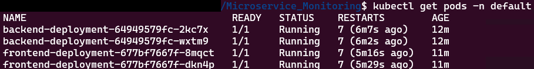
7. Access Frontend from Windows:
    - Get Frontend URL: `minikube service frontend-service --url -n default`

    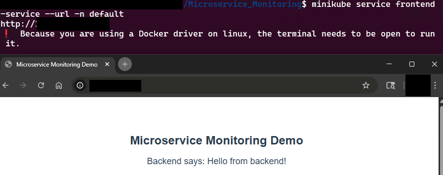
8. To view Kubernetes clusters:
    - `kubectl get svc`

    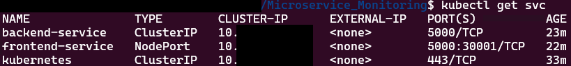

    - `minikube dashboard`

    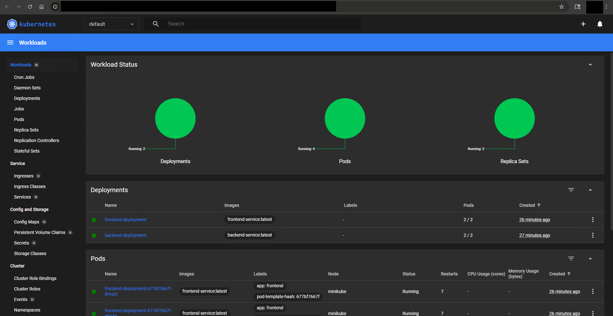

## Monitoring Stack

**Step 1: Create Monitoring Namespace**
    - Deploy all monitoring tools in `monitoring` namespace: `kubectl create namespace monitoring`

**Step 2: Deploy Prometheus**

Prometheus will scrape metrics from microservices. We’ll use the Prometheus Helm chart for easy deployment and configure it to monitor frontend and backend services.
1. Add Helm repository:
    - `helm repo add prometheus-community https://prometheus-community.github.io/helm-charts`
    - `helm repo update`
2. Install Prometheus
    - `mkdir -p ~/Microservice_Monitoring/observability/prometheus`
    - `helm install prometheus prometheus-community/prometheus -n monitoring -f observability/prometheus/values.yaml`
3. Verify Prometheus
    - `kubectl get pods -n monitoring -l "app.kubernetes.io/name=prometheus"`

    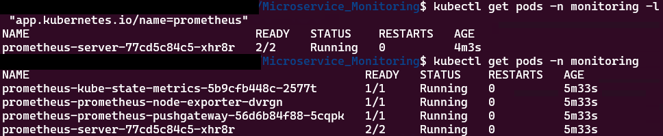

**Step 3: Deploy Jaeger**

Jaeger will handle distributed tracing. We’ll use the Jaeger all-in-one deployment for simplicity
1. Apply Jaeger
    - `kubectl apply -f observability/jaeger/jaeger-deployment.yaml`
2. Verify Jaeger is running
    - `kubectl get pods -n monitoring -l app=jaeger`

    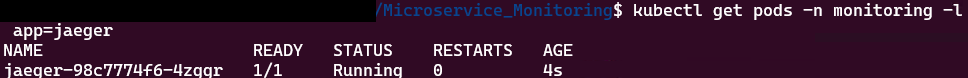

**Step 4: Deploy Loki**

Loki will aggregate logs. We’ll use the Grafana Loki Helm chart with a simple configuration (no persistent storage for Minikube).
1. Add Helm Repository
    - `helm repo add grafana https://grafana.github.io/helm-charts`
    - `helm repo update`
2. Install Loki
    - `mkdir -p ~/Microservice_Monitoring/observability/loki`
    - `helm install loki grafana/loki -n monitoring -f observability/loki/values.yaml`
3. Verify Loki is running
    - `kubectl get pods -n monitoring -l app.kubernetes.io/name=loki`

    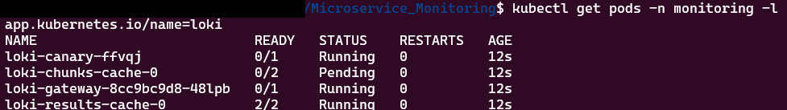

**Step 5: Deploy Grafana**

Grafana will visualize metrics, logs, and traces. We’ll use the Grafana Helm chart.
1. Install Grafana
    - `mkdir -p ~/Microservice_Monitoring/observability/grafana`
    - `helm install grafana grafana/grafana -n monitoring -f observability/grafana/values.yaml`
2. Verify Grafana is running
    - `kubectl get pods -n monitoring -l app.kubernetes.io/name=grafana`

    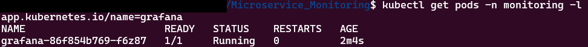

**Step 6: Instrument Microservice with OpenTelemetry (OTel)**

To collect metrics and traces, we’ll instrument your frontend and backend services with OpenTelemetry
    - `mkdir -p ~/Microservice_Monitoring/observability/opentelemetry`
- Rebuild and Redeploy:
    - `eval $(minikube docker-env)`
    - `docker build -t backend-service:latest app/backend/`
    - `docker build -t frontend-service:latest app/frontend/`
    - `kubectl apply -f app/backend/backend-deployment.yaml`
    - `kubectl apply -f app/backend/backend-service.yaml`
    - `kubectl apply -f app/frontend/frontend-deployment.yaml`
    - `kubectl apply -f app/frontend/frontend-service.yaml`

**Step 7: Configure Prometheus**

Add a ServiceMonitor to scrape OTel metrics from your services.
- `helm install prometheus-operator prometheus-community/kube-prometheus-stack --namespace monitoring --create-namespace`
- `kubectl apply -f observability/prometheus/service-monitor.yaml`

**Step 8: Access Monitoring UIs in Windows**

1. Grafana:
    - `minikube service grafana -n monitoring --url`
    - Login: `admin/admin`
    - Add dashboard: Prometheus ID 6417, Loki ID 12006
2. Jaeger:
    - `minikube service jaeger -n monitoring --url`
    - Verify if `frontend-service` and `backend-service` is running
3. Test the application
    - `minikube service frontend-service --url -n default`
    - This will generate some traffic, refresh the frontend URL, check Grafana for metrics/logs and Jaeger for traces
    - If UIs don’t load, ensure Docker Desktop is running and try `kubectl port-forward svc/grafana 3000:80 -n monitoring` and `http://localhost:3000`.

    - Loki logs sampled traffics
    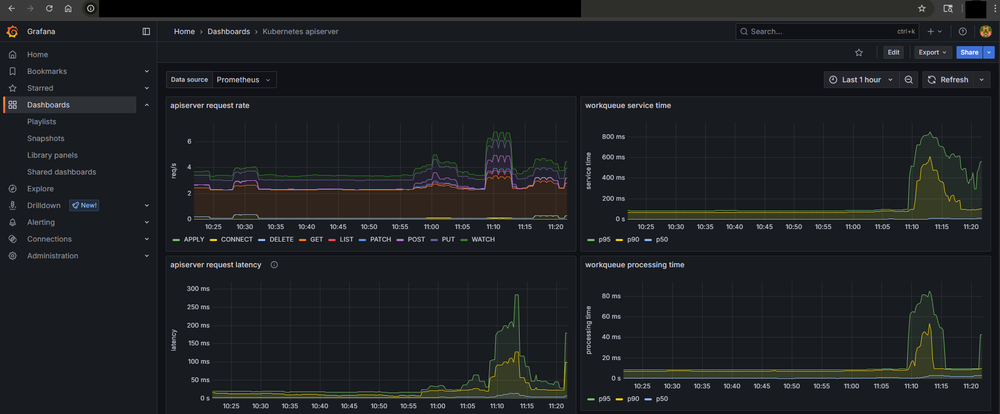

    - Prometheus showing health metrics, infrastructure and services:
    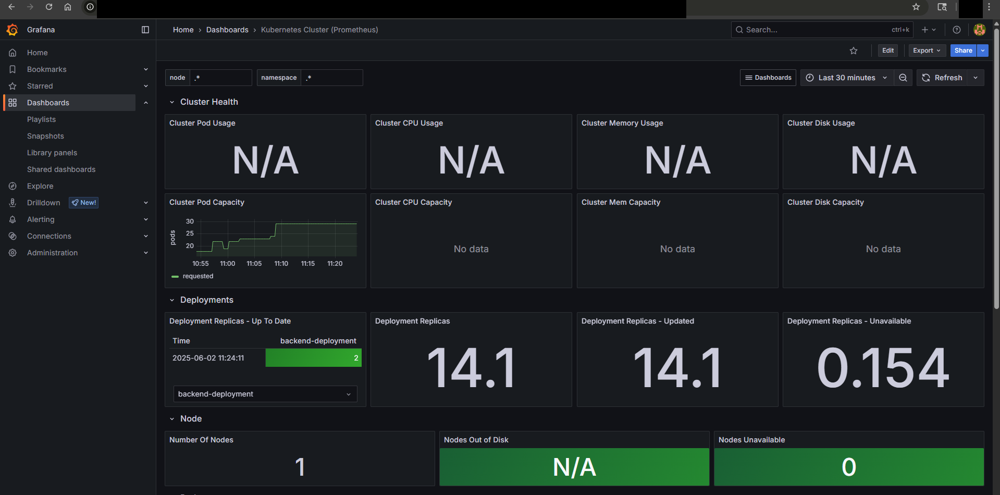

## Setup GitOps

Use ArgoCD to automatically deploy and manage your microservices (frontend, backend) and monitoring stack (Prometheus, Jaeger, Loki, Grafana) by syncing Kubernetes manifests from GitHub repo
Why ArgoCD? It’s a popular GitOps tool that automates Kubernetes deployments, tracks changes in Git, and provides a web UI for visualization. 

**Step 1: Install ArgoCD**

1. Create ArgoCD namespace:
    - `kubectl create namespace argocd`
    - `mkdir -p ~/Microservice_Monitoring/gitops/argocd-install`
2. Apply ArgoCD Manifest
    - `curl -sSL -o argocd-full-install.yaml https://raw.githubusercontent.com/argoproj/argo-cd/stable/manifests/install.yaml`
3. Apply ArgoCD
    - `kubectl apply -n argocd -f argocd-full-install.yaml`
4. Verfiy ArgoCD is running
    - `kubectl get pods -n argocd`

    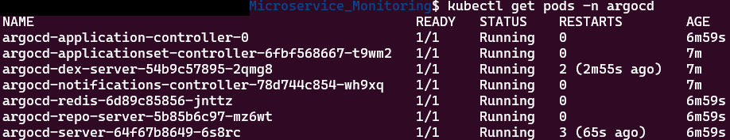

**Step 2: Access ArgoCD UI**

ArgoCD provides a web UI, which we’ll expose to your Windows browser.
1. Get ArgoCD URL
    - `minikube service argocd-server -n argocd --url`
2. Get ArgoCD password
    - `kubectl -n argocd get secret argocd-initial-admin-secret -o jsonpath="{.data.password}" | base64 -d`
3. Access via Windows browser
    - `admin/password`

**Step 3: Configure ArgoCD Application**

We’ll create ArgoCD Application resources to sync microservices and monitoring stack from GitHub repo
1.  Apply Application Manifests:
    - `kubectl apply -f gitops/applications/app.yaml`
    - `kubectl apply -f gitops/applications/monitoring.yaml`
2. Verify ArgoCD UI is synced
    - In Windows browser: `microservice` and `monitoring` should be `Healthy` and `Synced`
    - Or `kubectl get pods -n default` and `kubectl get pods -n monitoring`
    - Manual sync: `argocd app sync microservices` and `argocd app sync monitoring`

    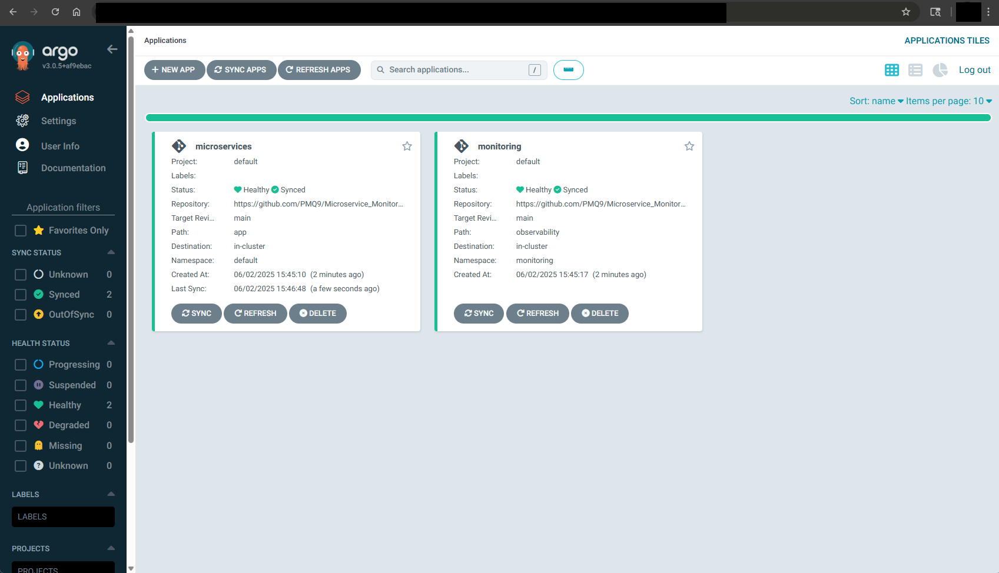

## Demo and Testing

**Demo**

- `chmod +x utils/demo.sh`

**Cleanup script**

Script to tear down the cluster for testing iterations.
- `chmod +x utils/cleanup.sh`

**Auto test script**

- `chmod +x utils/test.sh`
- `sudo apt install -y nodejs`
- `node utils/load-test.js $(minikube service frontend-service --url -n default)`

## Key Features

- Kubernetes: deploy a microservice cluster
- Minikube: deploy Kubernetes on local server
- Windows Subsystem Linux 2 (WSL2): run Linux machine in Windows environment
- Prometheus: Collect metrics
- OpenTelemetry (OTel): Instruments the app for metrics and traces, sending data to Prometheus and Jaeger
- Jaeger: Visualizes distributed traces (request flows between frontend and backend).
- Loki: Aggregates logs from microservices
- Grafana: Displays dashboards for metrics (Prometheus), traces (Jaeger), and logs (Loki).

## Structure
    Microservice_Monitoring/
    │
    ├── .tool-versions
    ├── app/
    │   ├── frontend/               # Frontend manifests
    │   └── backend/                # Backend manifests
    ├── observability/
    │   ├── prometheus/             # Prometheus manifests
    │   ├── opentelemetry/          # OTel configs
    │   ├── jaeger/                 # Jaeger manifests
    │   ├── loki/                   # Loki manifests
    │   └── grafana/                # Grafana manifests
    ├── gitops/
    │   ├── argocd-install/         # ArgoCD installation manifests
    │   └── applications/           # ArgoCD Application manifests
    ├── utils/
    │   └── setup/
    │       ├── setup-tools-asdf.sh
    │       └── setup-tools-bash.sh
    └── README.md